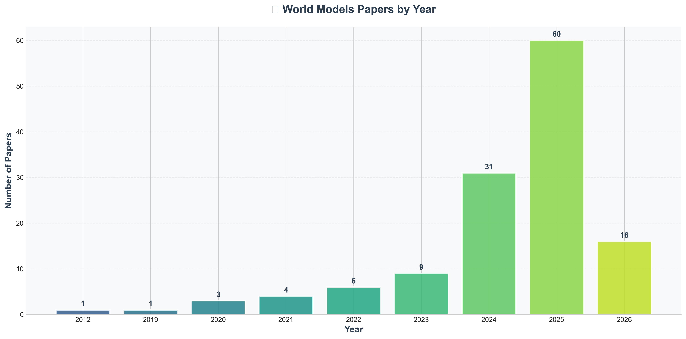
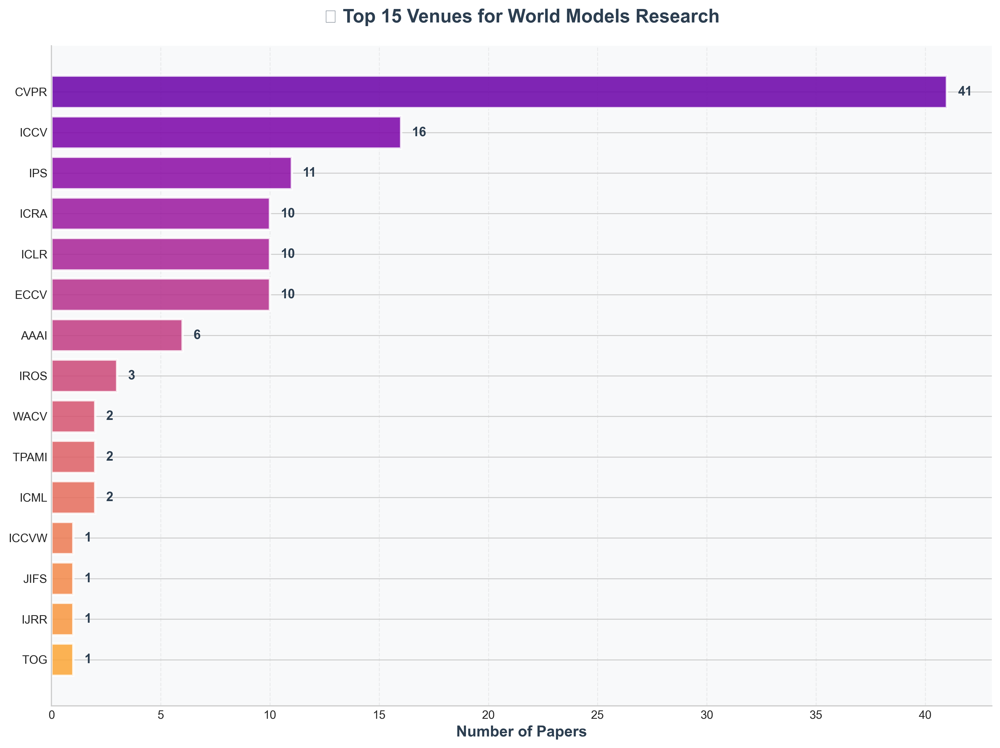
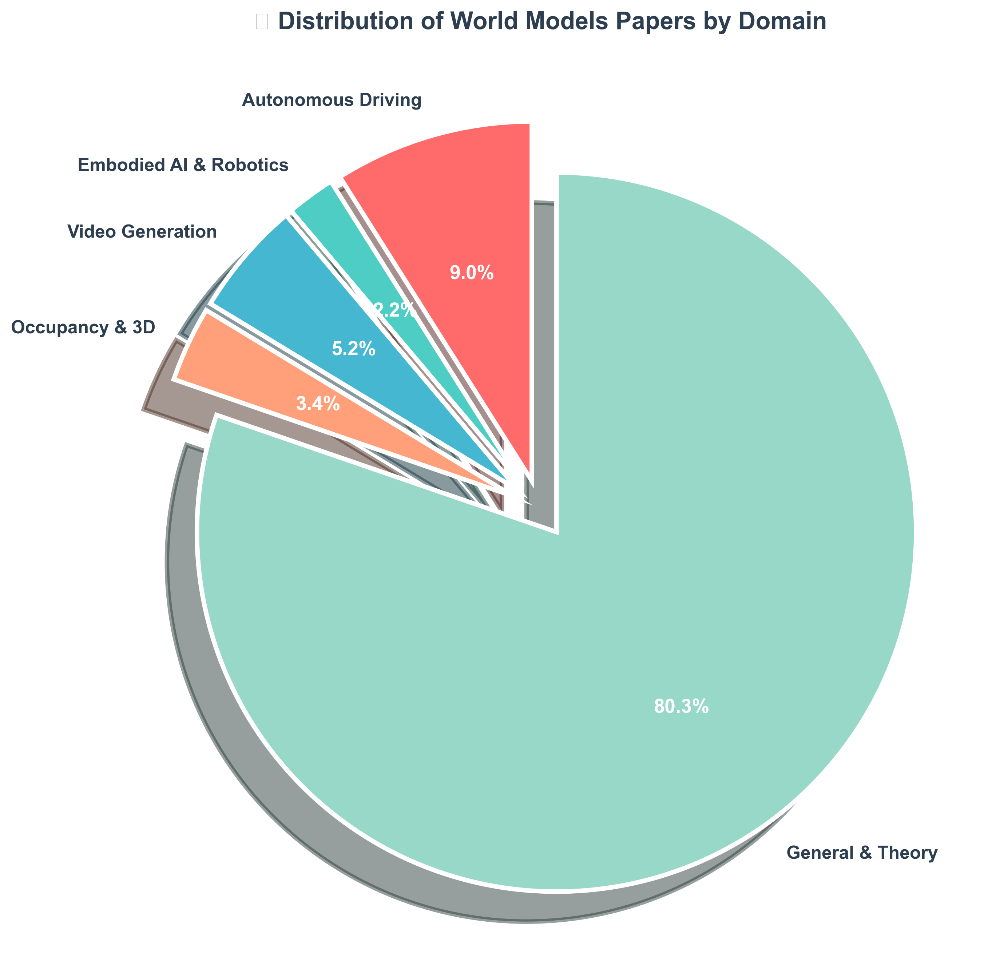
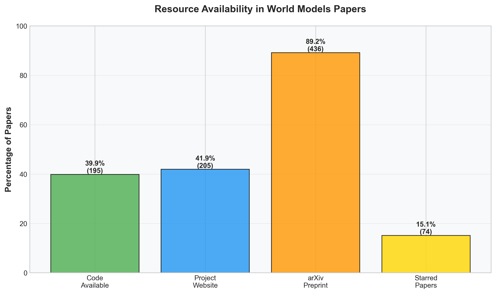

<div align="center">

# 🌍 Awesome World Models

[](https://awesome.re)

[](LICENSE)
[](CONTRIBUTING.md)

**The Most Comprehensive Collection of World Models Research**

*Spanning Video Generation, 3D/4D Modeling, Autonomous Driving, Embodied AI, and Beyond*


</div>


## 🔥 News & Updates

- **[2026-03-06]** 🎉 Repository launched! Unified collection of 489 papers from four major World Models repositories
- **[2026-03-06]** 🆕 Added 11 latest papers from arXiv 2026 (LaST-VLA, ResWorld, DriveWorld-VLA, etc.)
- **[2026-03-06]** 📊 Added comprehensive statistics and visualizations: 74 starred papers, 195 with code
- **[2026-03-06]** 🗂️ Introduced dual-dimension taxonomy: Paradigm (VideoGen/OccGen/LiDARGen) + Application domains
- **[2026-03-06]** 🤖 Integrated learning resources: talks, courses, tutorials, and datasets

---

## 📖 Table of Contents

- [💡 What are World Models?](#-what-are-world-models)
- [🗺️ Taxonomy](#️-taxonomy)
- [📚 Research](#-research)
  - [Surveys & Reviews](#surveys--reviews)
  - [Papers by Paradigm](#papers-by-paradigm)
    - [🎬 VideoGen: Video-based World Models](#-videogen-video-based-world-models)
    - [🧊 OccGen: Occupancy-based World Models](#-occgen-occupancy-based-world-models)
    - [📡 LiDARGen: LiDAR-based World Models](#-lidargen-lidar-based-world-models)
  - [Papers by Application](#papers-by-application)
    - [🚗 Autonomous Driving](#-autonomous-driving)
    - [🤖 Embodied AI & Robotics](#-embodied-ai--robotics)
    - [🎮 Game Simulation & XR](#-game-simulation--xr)
    - [🔬 Scientific Applications](#-scientific-applications)
  - [💡 Theory & Explainability](#-theory--explainability)
  - [🏢 Industry Reports](#-industry-reports)
- [🎓 Learning Resources](#-learning-resources)
  - [📺 Talks & Presentations](#-talks--presentations)
  - [🎓 Courses & Tutorials](#-courses--tutorials)
- [🔧 Practical Resources](#-practical-resources)
  - [📊 Datasets](#-datasets)
  - [🎯 Benchmarks & Leaderboards](#-benchmarks--leaderboards)
  - [🛠️ Tools & Libraries](#️-tools--libraries)
- [🌐 Community](#-community)
  - [🏆 Workshops & Challenges](#-workshops--challenges)
  - [👥 Research Groups](#-research-groups)
- [🤝 Contributing](#-contributing)
- [📜 Citation](#-citation)
- [⭐ Star History](#-star-history)

---

## 💡 What are World Models?

**World Models** are AI systems that learn internal representations of their environment to predict future states, simulate scenarios, and enable intelligent decision-making. They bridge perception and action by building a mental model of how the world works.

### Key Concepts

- **Predictive Modeling**: Learning to forecast future observations from current state and actions
- **Latent Representations**: Compressing high-dimensional sensory data into meaningful internal states
- **Simulation**: Generating synthetic experiences for planning, training, and evaluation
- **Generalization**: Transferring learned world knowledge to new scenarios and tasks

### Why World Models Matter

1. **Data Efficiency**: Learn from fewer real-world interactions by leveraging simulated experience
2. **Safety**: Test dangerous scenarios in simulation before deployment
3. **Interpretability**: Explicit world representations enable better understanding of AI decisions
4. **Generalization**: Transfer knowledge across tasks and domains
5. **Planning**: Enable look-ahead reasoning for complex decision-making

---

## 🗺️ Taxonomy

This repository organizes world models research along **two complementary dimensions**:

### Dimension 1: Representation Paradigms

How world models represent and generate environmental states:

- **🎬 VideoGen**: Video-based representations using pixel-space generation
  - Leverages powerful video generation models (diffusion, transformers)
  - Natural for camera-based perception systems
  - Examples: Genie, GAIA-1, DriveDreamer

- **🧊 OccGen**: Occupancy-based 3D representations
  - Explicit 3D spatial structure using voxel grids or occupancy fields
  - Efficient for 3D reasoning and planning
  - Examples: OccWorld, GaussianWorld, UniScene

- **📡 LiDARGen**: LiDAR-based point cloud generation
  - Direct modeling of 3D sensor data
  - Preserves geometric precision
  - Examples: LiDARGen, DynamicCity, LiSTAR

### Dimension 2: Application Domains

Where world models are applied:

- **🚗 Autonomous Driving**: Scene prediction, planning, and simulation for self-driving vehicles
- **🤖 Embodied AI & Robotics**: Manipulation, navigation, and interaction in physical environments
- **🎮 Game Simulation & XR**: Procedural content generation and interactive experiences
- **🔬 Scientific Applications**: Physics simulation, molecular dynamics, climate modeling

> 📖 For detailed taxonomy explanation, see [docs/research/taxonomy.md](docs/research/taxonomy.md)

---

## 📚 Research

### Surveys & Reviews

Comprehensive surveys and review papers on world models:

| Title | Venue | Resources |
|-------|-------|-----------|
| ⭐ **The Role of World Models in Shaping Autonomous Driving: A Comprehensive Survey** | `arXiv 25.02` | [](https://arxiv.org/abs/2502.10498) |
| **Aligning Cyber Space with Physical World: A Comprehensive Survey on Embodied AI** | `TMECH 25` | [](https://arxiv.org/abs/2407.06886) [](https://github.com/HCPLab-SYSU/Embodied_AI_Paper_List) |
| **3D and 4D World Modeling: A Survey** | `arXiv 25.09` | [](https://arxiv.org/abs/2509.07996) [](https://github.com/worldbench/survey) |
| **A Comprehensive Survey on World Models for Embodied AI** | `arXiv 25.10` | [](https://arxiv.org/abs/2510.16732) [](https://github.com/Li-Zn-H/AwesomeWorldModels) |
| **A Step Toward World Models: A Survey on Robotic Manipulation** | `arXiv 25.11` | [](https://arxiv.org/abs/2511.02097) |
| **A Survey of Embodied World Models** | `25.09` | [](https://www.researchgate.net/publication/395713824_A_Survey_of_Embodied_World_Models) |
| **A Survey on Future Physical World Generation for Autonomous Driving** | `MMAsia 25` | [](https://dl.acm.org/doi/full/10.1145/3769748.3773345) |
| **The Safety Challenge of World Models for Embodied AI Agents: A Review** | `arXiv 25.10` | [](https://arxiv.org/abs/2510.05865) |
| **Progressive Robustness-Aware World Models in Autonomous Driving: A Review and Outlook** | `techrXiv 25.11` | [](https://doi.org/10.36227/techrxiv.176523308.84756413/v1) [](https://github.com/MoyangSensei/AwesomeRobustDWM) |
| ⭐ **A Path Towards Autonomous Machine Intelligence** (Yann LeCun) | `OpenReview` | [](https://openreview.net/pdf?id=BZ5a1r-kVsf) [](https://www.youtube.com/watch?v=OKkEdTchsiE) |

> 📖 For complete list of surveys, see [docs/research/surveys.md](docs/research/surveys.md)

---

### Papers by Paradigm

#### 🎬 VideoGen: Video-based World Models

Video-based world models generate future frames in pixel space, leveraging powerful video generation architectures.

**Key Papers:**


#### 🚗 Autonomous Driving Papers

| Paper | Venue | Resources |
|-------|-------|-----------|
| ⭐ **LaST-VLA: Latent Spatio-Temporal VLA for Autonomous Driving** | `arXiv 2026` | [](https://arxiv.org/abs/2603.01928) |
| ⭐ **Hyper Diffusion Planner: End-to-End Autonomous Driving with Real-Vehicle Deployment** | `arXiv 2026` | [](https://arxiv.org/abs/2602.22801) |
| ⭐ **ResWorld: Temporal Residual World Model for Dynamic Object Modeling** | `arXiv 2026` | [](https://arxiv.org/abs/2602.10884) |
| ⭐ **DriveWorld-VLA: Unifying World Modeling and Planning in Latent Space** | `arXiv 2026` | [](https://arxiv.org/abs/2602.06521) |
| **RaWMPC: Risk-aware World Model Predictive Control** | `arXiv 2026` | [](https://arxiv.org/abs/2602.23259) |
| **DiffusionHarmonizer: Online Generative Enhancement for Driving Simulation** | `arXiv 2026` | [](https://arxiv.org/abs/2602.24096) |
| ⭐ **A Survey of World Models for Autonomous Driving** | `-` | [](https://arxiv.org/abs/2501.11260) |
| ⭐ **Cosmos-Drive-Dreams** | `-` | [](https://arxiv.org/abs/2506.09042) [](https://github.com/nv-tlabs/Cosmos-Drive-Dreams) [](https://research.nvidia.com/labs/toronto-ai/cosmos_drive_dreams) |
| **Drive-OccWorld** | `AAAI 2025` | [](https://arxiv.org/abs/2408.14197) [](https://github.com/yuyang-cloud/Drive-OccWorld) [](https://drive-occworld.github.io/) |
| **DriveDreamer-2** | `AAAI 2025` | [](https://arxiv.org/abs/2403.06845) [](https://drivedreamer2.github.io/) [](https://drivedreamer2.github.io/) |
| **DriveDreamer4D** | `CVPR 2025` | [](https://arxiv.org/abs/2410.13571) [](https://github.com/GigaAI-research/DriveDreamer4D) [](https://drivedreamer4d.github.io/) |
| **MagicDrive-V2** | `ICCV 2025` | [](https://arxiv.org/abs/2411.13807) [](https://gaoruiyuan.com/magicdrive-v2/) |
| **SubjectDrive** | `AAAI 2025` | [](https://arxiv.org/abs/2403.19438) [](https://subjectdrive.github.io/) |
| **DriveDreamer** | `ECCV 2024` | [](https://arxiv.org/abs/2309.09777) [](https://github.com/JeffWang987/DriveDreamer) [](https://drivedreamer.github.io/) |
| **DriveWorld** | `CVPR 2024` | [](https://arxiv.org/abs/2405.04390) |
| **DrivingDiffusion** | `ECCV 2024` | [](https://arxiv.org/abs/2310.07771) [](https://github.com/shalfun/DrivingDiffusion) [](https://drivingdiffusion.github.io/) |
| **DrivingDojo Dataset** | `IPS 2024` | [](https://arxiv.org/abs/2410.10738) [](https://drivingdojo.github.io/) |
| **MagicDrive** | `ICLR 2024` | [](https://arxiv.org/abs/2310.02601) [](https://github.com/cure-lab/MagicDrive) [](https://gaoruiyuan.com/magicdrive/) |
| **Workshop on Foundation Models for Autonomous Systems** | `CVPR 2024` | - |
| **AdaptiveDriver** | `-` | [](https://arxiv.org/abs/2406.10714) [](https://arunbalajeev.github.io/world_models_planning/world_model_paper.html) |
| **Dream to Drive** | `-` | [](https://arxiv.org/abs/2502.10012) |
| **Dream4Drive** | `-` | [](https://arxiv.org/abs/2510.19195) [](https://wm-research.github.io/Dream4Drive/) |
| **Drive-JEPA** | `-` | [](https://arxiv.org/abs/2601.22032) |
| **DriveGenVLM** | `-` | [](https://arxiv.org/abs/2408.16647) |
| **DrivePhysica** | `-` | [](https://arxiv.org/abs/2412.08410) [](https://metadrivescape.github.io/papers_project/DrivePhysica/page.html) [](https://metadrivescape.github.io/papers_project/DrivePhysica/page.html) |
| **DriveVLA-W0** | `-` | [](https://arxiv.org/abs/2510.12796) |
| **DrivingGPT** | `-` | [](https://arxiv.org/abs/2412.18607) [](https://rogerchern.github.io/DrivingGPT/) |
| **DrivingGen** | `-` | [](https://arxiv.org/abs/2601.01528) [](https://drivinggen-bench.github.io/) |
| **DrivingWorld** | `-` | [](https://arxiv.org/abs/2412.19505) [](https://github.com/YvanYin/DrivingWorld) [](https://huxiaotaostasy.github.io/DrivingWorld/index.html) |
| **GenieDrive** | `-` | [](https://arxiv.org/abs/2512.12751) [](https://huster-yzy.github.io/geniedrive_project_page/) |
| **ImagiDrive** | `-` | [](https://arxiv.org/abs/2508.11428) [](https://github.com/fudan-zvg/ImagiDrive) |
| **Imagine-2-Drive** | `-` | [](https://arxiv.org/abs/2411.10171) [](https://anantagrg.github.io/Imagine-2-Drive.github.io/) |
| **InfinityDrive** | `-` | [](https://arxiv.org/abs/2412.01522) [](https://metadrivescape.github.io/papers_project/InfinityDrive/page.html) |
| **Interplay Between Video Generation and World Models in Autonomous Driving** | `-` | [](https://arxiv.org/abs/2411.02914) |
| **LatentDriver** | `-` | [](https://arxiv.org/abs/2409.15730) [](https://github.com/Sephirex-X/LatentDriver) |
| **MagicDrive3D** | `-` | [](https://arxiv.org/abs/2405.14475) [](https://gaoruiyuan.com/magicdrive3d/) [](https://gaoruiyuan.com/magicdrive3d/) |
| **MoVieDrive** | `-` | [](https://arxiv.org/abs/2508.14327) |
| **Progressive Robustness-Aware World Models in Autonomous Driving: A Survey** | `-` | [](https://github.com/MoyangSensei/AwesomeRobustDWM) |
| **Think Before You Drive** | `-` | [](https://arxiv.org/abs/2512.03454) |
| **Think2Drive** | `-` | [](https://arxiv.org/abs/2402.16720) |
| **TrafficBots** | `-` | [](https://arxiv.org/abs/2303.04116) [](https://github.com/zhejz/TrafficBots) |
| **UniDrive-WM** | `-` | [](https://arxiv.org/abs/2601.04453) [](https://unidrive-wm.github.io/UniDrive-WM) |
| **World Models for Autonomous Driving: An Initial Survey** | `-` | [](https://arxiv.org/abs/2403.02622) |
| **World4Drive** | `-` | [](https://arxiv.org/abs/2507.00603) |
| **`CVPR 24 Workshop & Challenge | OpenDriveLab`** | `-` | - |
| **`CVPR 25 Workshop & Challenge | OpenDriveLab`** | `-` | - |

---

### Papers by Application

#### 🚗 Autonomous Driving

World models for scene prediction, planning, and simulation in self-driving vehicles.

> 📄 See complete list above (40 papers total)

---

#### 🤖 Embodied AI & Robotics

World models for manipulation, navigation, and interaction in physical environments.


#### 🤖 Embodied AI Papers

| Paper | Venue | Resources |
|-------|-------|-----------|
| **GaussTwin: Unified Simulation and Correction with Gaussian Splatting for Robotic Digital Twins** | `arXiv 2026` | [](https://arxiv.org/abs/2603.05108) |
| ⭐ **"Learning Primitive Embodied World Models: Towards Scalable Robotic Learning"** | `-` | [](https://arxiv.org/pdf/2508.20840) [](https://qiaosun22.github.io/PrimitiveWorld/) |
| ⭐ **Agent Learning via Early Experience** | `-` | [](https://arxiv.org/pdf/2510.08558) |
| ⭐ **General agents Contain World Models** | `-` | [](https://arxiv.org/abs/2506.01622) |
| ⭐ **Persistent Embodied World Models** | `-` | [](https://arxiv.org/abs/2505.05495) |
| ⭐ **Self-Improving Embodied Foundation Models** | `-` | [](https://arxiv.org/abs/2509.15155) |
| ⭐ **World Models for Embodied AI** | `-` | [](https://arxiv.org/abs/2510.16732) [](https://github.com/Li-Zn-H/AwesomeWorldModels) |
| **Workshop on Embodied World Models for Decision Making** | `IPS 2025` | - |
| **EmbodieDreamer** | `-` | [](https://arxiv.org/pdf/2507.05198) [](https://github.com/GigaAI-research/EmbodieDreamer) [](https://embodiedreamer.github.io/) |
| **Embodied AI Agents: Modeling the World** | `-` | [](https://arxiv.org/abs/2506.22355) |
| **PhysicalAgent** | `-` | [](https://arxiv.org/abs/2509.13903) |
| **Video Agent** | `-` | [](http://arxiv.org/abs/2410.10076) [](https://video-as-agent.github.io/) |
| **Web Agents with World Models** | `-` | [](https://arxiv.org/abs/2410.13232) |

#### 🦾 Robotics Papers

| Paper | Venue | Resources |
|-------|-------|-----------|
| ⭐ **"Learning Primitive Embodied World Models: Towards Scalable Robotic Learning"** | `-` | [](https://arxiv.org/pdf/2508.20840) [](https://qiaosun22.github.io/PrimitiveWorld/) |
| ⭐ **"Multi-Task Interactive Robot Fleet Learning with Visual World Models"** | `-` | [](https://arxiv.org/abs/2410.22689) [](https://github.com/UT-Austin-RPL/sirius-fleet/) [](https://ut-austin-rpl.github.io/sirius-fleet/) |
| ⭐ **"Object-Centric World Model for Language-Guided Manipulation" [](https://arxiv.org/abs/2503.06170) |
| ⭐ **Robotic World Model** | `-` | [](https://arxiv.org/abs/2501.10100) |

---

#### 🎮 Game Simulation & XR

World models for procedural content generation and interactive experiences.


#### 🎮 Game & Simulation Papers

| Paper | Venue | Resources |
|-------|-------|-----------|
| ⭐ **Is Sora a World Simulator** | `-` | [](https://arxiv.org/abs/2405.03520) [](https://github.com/GigaAI-research/General-World-Models-Survey) |
| ⭐ **Matrix-Game** | `-` | [](https://arxiv.org/abs/2506.18701) [](https://github.com/SkyworkAI/Matrix-Game) |
| ⭐ **Matrix-Game 2.0** | `-` | [](https://arxiv.org/abs/2508.13009) [](https://github.com/SkyworkAI/Matrix-Game/tree/main/Matrix-Game-2) [](https://matrix-game-v2.github.io/) |
| **AnimeGamer** | `-` | [](http://arxiv.org/abs/2504.01014) [](https://howe125.github.io/AnimeGamer.github.io/) |
| **GameFactory** | `-` | [](http://arxiv.org/abs/2501.08325) [](https://github.com/KwaiVGI/GameFactory) [](https://yujiwen.github.io/gamefactory/) |
| **Hunyuan-GameCraft-2** | `-` | [](https://arxiv.org/abs/2511.23429) [](https://hunyuan-gamecraft-2.github.io/) |
| **Interactive Generative Video as Next-Generation Game Engine** | `-` | [](http://arxiv.org/abs/2503.17359) |
| **Interplay Between Video Generation and World Models in Autonomous Driving** | `-` | [](https://arxiv.org/abs/2411.02914) |
| **World Models and Physical Simulation** | `-` | [](https://arxiv.org/abs/2507.00917) [](https://github.com/NJU3DV-LoongGroup/Embodied-World-Models-Survey) |

---

#### 👥 Social World Models & Multi-Agent Systems

World models for social interaction, multi-agent coordination, and human behavior prediction.

| Paper/Project | Type | Resources |
|---------------|------|-----------|
| **FreeAskWorld** | Framework | [](https://github.com/AIR-DISCOVER/FreeAskWorld) []() |
| **Model-Based Social Navigation** | Navigation | [](https://github.com/ZJU-Robotics-Lab/model-based-social-navigation) |
| **SOMA: Socio-physical Model of Activities** | Activity Model | [](https://github.com/ease-crc/soma) |
| **Mini-Genie: Multi-Agent World Model** | Multi-Agent | [](https://github.com/danimelatru/Mini-Genie) |
| **Social World Model Simulation** | Simulation | [](https://github.com/XuhuiZhou/social-world-model) |
| **MotionLM: Multi-Agent Motion Forecasting** | Prediction | [](https://waymo.com/research/motionlm/) |
| **Melting Pot: Multi-Agent RL Evaluation** | Benchmark | [](https://deepmind.google/blog/melting-pot-an-evaluation-suite-for-multi-agent-reinforcement-learning/) |

**Key Topics:**
- 🤝 Human-robot interaction modeling
- 🚶 Pedestrian behavior prediction
- 🎭 Social navigation in crowded environments
- 🤖 Multi-agent coordination and communication
- 🧠 Theory of mind for AI agents

> 📖 For more on multi-agent systems, see [Multi-Agent Reinforcement Learning](https://en.wikipedia.org/wiki/Multi-agent_reinforcement_learning)

---

## 🎓 Learning Resources

### 📺 Talks & Presentations

Key talks and presentations on world models:

| Title | Speaker | Venue | Resources |
|-------|---------|-------|-----------|
| **A Path Towards Autonomous Machine Intelligence** | Yann LeCun | Meta AI | [](https://www.youtube.com/watch?v=OKkEdTchsiE) [](https://openreview.net/pdf?id=BZ5a1r-kVsf) |
| **World Models for Autonomous Driving** | Ashok Elluswamy | Tesla AI Day 2024 | [](https://www.youtube.com/watch?v=6x-Xb_uT7ts) |
| **GAIA-1: A Generative World Model for Autonomous Driving** | Wayve Team | NVIDIA GTC 2023 | [](https://wayve.ai/thinking/gaia1/) |
| **NVIDIA Cosmos: Physical AI with World Foundation Models** | NVIDIA Team | GTC 2025 | [](https://www.nvidia.com/en-us/ai/cosmos/) |
| **Genie: Generative Interactive Environments** | DeepMind Team | Tech Talk 2024 | [](https://sites.google.com/view/genie-2024) |

> 📺 For complete list of talks (50+), see [docs/learning/talks.md](docs/learning/talks.md)

---

### 🎓 Courses & Tutorials

**Online Courses:**
- **Deep Reinforcement Learning** (UC Berkeley CS285) - Covers model-based RL and world models [](http://rail.eecs.berkeley.edu/deeprlcourse/)
- **Stanford CS330: Deep Multi-Task and Meta Learning** - Includes world model architectures [](https://cs330.stanford.edu/)
- **MIT 6.S898: Deep Learning** - Foundation models and world models [](https://phillipi.github.io/6.s898/)

**Tutorials:**
- [Implementing DreamerV3 from Scratch](https://github.com/danijar/dreamerv3) - Official PyTorch implementation
- [World Models Tutorial](https://worldmodels.github.io/) - Interactive introduction to world models
- [CARLA Autonomous Driving Tutorial](https://carla.readthedocs.io/) - Simulation-based learning

> 🎓 For complete list of courses and tutorials (30+), see [docs/learning/tutorials.md](docs/learning/tutorials.md)

---

## 🔧 Practical Resources

### 📊 Datasets

**Autonomous Driving:**
- **nuScenes** - 1000 scenes with camera, LiDAR, radar [](https://www.nuscenes.org/) [](https://arxiv.org/abs/1903.11027)
- **Waymo Open Dataset** - 1000 segments, 200k frames [](https://waymo.com/open/)
- **KITTI** - Classic autonomous driving benchmark [](http://www.cvlibs.net/datasets/kitti/)
- **Argoverse 2** - 1000 scenarios, forecasting [](https://www.argoverse.org/)
- **Occ3D** - 16k frames for occupancy prediction [](https://tsinghua-mars-lab.github.io/Occ3D/)
- **CARLA** - Open-source driving simulator [](https://carla.org/)

**Robotics:**
- **CALVIN** - 24k manipulation trajectories [](http://calvin.cs.uni-freiburg.de/) [](https://github.com/mees/calvin)
- **RoboNet** - 15M robot manipulation frames [](https://www.robonet.wiki/)
- **RoboCasa** - 100k kitchen manipulation trajectories [](https://robocasa.ai/)
- **Open X-Embodiment** - 1M+ multi-robot trajectories [](https://robotics-transformer-x.github.io/)
- **Habitat-Matterport 3D** - 90 indoor scenes [](https://aihabitat.org/)

**Games:**
- **Minecraft** - Procedural 3D environments
- **Atari 2600** - Classic RL benchmark (57 games)
- **MineRL** - 60M frames of Minecraft gameplay [](https://minerl.io/)

> 📊 For complete list of datasets (50+), see [docs/resources/datasets.md](docs/resources/datasets.md)

---

### 🎯 Benchmarks & Leaderboards

**Evaluation Tools:**
- **WorldLens** - Comprehensive evaluation framework for driving world models [](https://arxiv.org/abs/2512.10958)
- **VBench** - Video generation quality metrics [](https://arxiv.org/abs/2311.17982)
- **FVD** - Fréchet Video Distance for video quality
- **LPIPS** - Learned Perceptual Image Patch Similarity

> 🎯 For complete benchmarks and leaderboards, see [docs/resources/benchmarks.md](docs/resources/benchmarks.md)

---

### 🛠️ Tools & Libraries

**Frameworks:**
- **DreamerV3** - State-of-the-art model-based RL [](https://github.com/danijar/dreamerv3)
- **Stable Diffusion** - Foundation for video generation models
- **PyTorch3D** - 3D deep learning library

**Simulation:**
- **CARLA** - Open-source driving simulator [](https://carla.org/)
- **Isaac Sim** - NVIDIA robotics simulator
- **MuJoCo** - Physics engine for robotics

> 🛠️ For complete list of tools, see [docs/resources/tools.md](docs/resources/tools.md)

---

## 🌐 Community

### 🏆 Workshops & Challenges

- **CVPR 2025 Workshop on World Models** [](https://world-models-workshop.github.io/)
- **ICCV 2025 Workshop on 4D World Models** - Bridging Generation and Reconstruction
- **OpenDriveLab Challenges** - Annual autonomous driving competitions

> 🏆 For complete list of workshops, see [docs/community/workshops.md](docs/community/workshops.md)

---

### 👥 Research Groups

**Leading Labs:**
- **NVIDIA Toronto AI Lab** - Cosmos, GAIA series
- **Wayve** - End-to-end driving with world models
- **Tesla AI** - FSD world model development
- **UC Berkeley RAIL** - Model-based RL research
- **DeepMind** - Genie, DreamerV3

> 👥 For complete list of research groups, see [docs/community/research-groups.md](docs/community/research-groups.md)

---

## 🤝 Contributing

We welcome contributions! Please see [CONTRIBUTING.md](CONTRIBUTING.md) for guidelines.

**How to contribute:**
1. Fork the repository
2. Add your paper/resource following the format
3. Ensure all links are valid
4. Submit a pull request

**Format for papers:**
```markdown
| **Paper Title** | `Venue Year` | [](url) [](url) |
```

---

## 📜 Citation

If you find this repository useful, please consider citing:

```bibtex
@misc{awesome-world-models-2026,
  title={Awesome World Models: A Comprehensive Collection},
  author={World Models Community},
  year={2026},
  howpublished={\url{https://github.com/awesome-world-models}}
}
```

---

## ⭐ Star History

[](https://star-history.com/#awesome-world-models/awesome-world-models-unified&Date)

---

## 📊 Repository Statistics

### Overview

- **Total Papers**: 489
- **Starred Papers**: 74
- **Papers with Code**: 195 (40%)
- **Year Range**: 2012 - 2026
- **Top Venues**: CVPR (41), ICCV (16), ICLR (10)

### Visualizations

<div align="center">

#### Papers by Year


#### Top Venues


#### Category Distribution


#### Resource Availability


</div>

**Last Updated**: March 6, 2026

---

<div align="center">

Made with ❤️ by the World Models community

[⬆ Back to Top](#-awesome-world-models)

</div>
